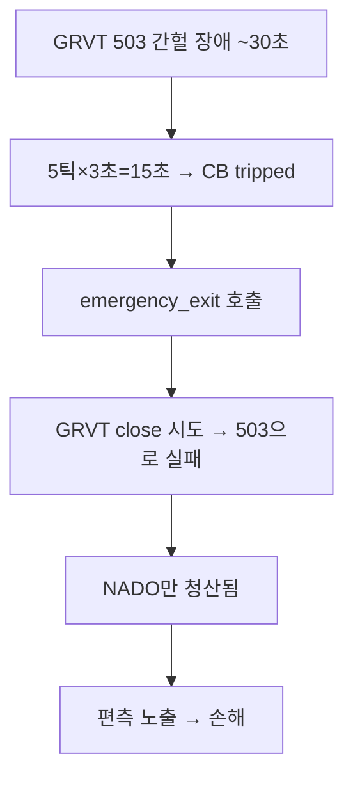

# 편측 청산 방지 — 근본 수정 계획 (v2)

## 문제 분석

### HTTP 503이란?
**503 Service Unavailable** = GRVT 서버가 **일시적으로** 요청을 처리 못하는 상태.
- **원인**: Cloudflare 뒤 GRVT 서버 점검, 과부하, 배포 중 등
- **특성**: **간헐적 & 자동 복구됨** — 보통 1~5분이면 정상화
- 로그에서도 01:29:42~01:30:05 약 30초간 503 연속 → 01:30:11에 정상 복귀 확인

### 진짜 문제: circuit breaker가 과민 반응
```
HOLD 중 _handle_hold() 매 3초(POLL_INTERVAL) 호출
  → get_mark_price(pair) 실패 → _cb.record_failure("grvt")
  → 5번 연속 실패(15초) → circuit_breaker tripped!
  → _emergency_exit("circuit_breaker") → 포지션 전량 청산 시도 💀
```

**현재 설정:** `CIRCUIT_BREAKER_FAILS = 5`, `POLL_INTERVAL = 3초`
→ **15초만 API 안 되면 포지션 전량 청산** → 이게 과민 반응의 근본 원인

### 사고 체인


## 수정 계획

- [x] **1. circuit_breaker 동작 변경: "exit"이 아닌 "pause & wait"**
  - CB tripped → HOLD_SUSPENDED 전환 (포지션 유지, API 복구 대기)
  - 복구 시 HOLD 자동 복귀
  - 5분 미복구 → 텔레그램 알림
  - 30분 미복구 → MANUAL_INTERVENTION 전환

- [x] **2. _emergency_exit는 진짜 위험한 경우만**
  - ✅ price_divergence EMERGENCY만 사용
  - ❌ circuit_breaker → HOLD_SUSPENDED로 대체

- [x] **3. dust retry 루프 원자적 순서 보장**
  - GRVT close 먼저 → 성공해야 NADO close
  - GRVT 실패 시 NADO 건드리지 않고 continue

- [x] **4. 안전장치**
  - 봇 재시작 시 HOLD_SUSPENDED 상태면 타이머 리셋
  - position restore에 HOLD_SUSPENDED 상태 포함

## 수정 파일

| 파일 | 변경 |
|------|------|
| models.py | CycleState.HOLD_SUSPENDED 추가 |
| config.py | SUSPENDED_ALERT_SECONDS(5분), SUSPENDED_MANUAL_SECONDS(30분) |
| nado_grvt_engine.py | _handle_hold: CB→HOLD_SUSPENDED, _handle_hold_suspended 신규, dust retry 원자적 순서 |

## 테스트 결과
✅ 51 passed (기존 테스트 전부 통과)
